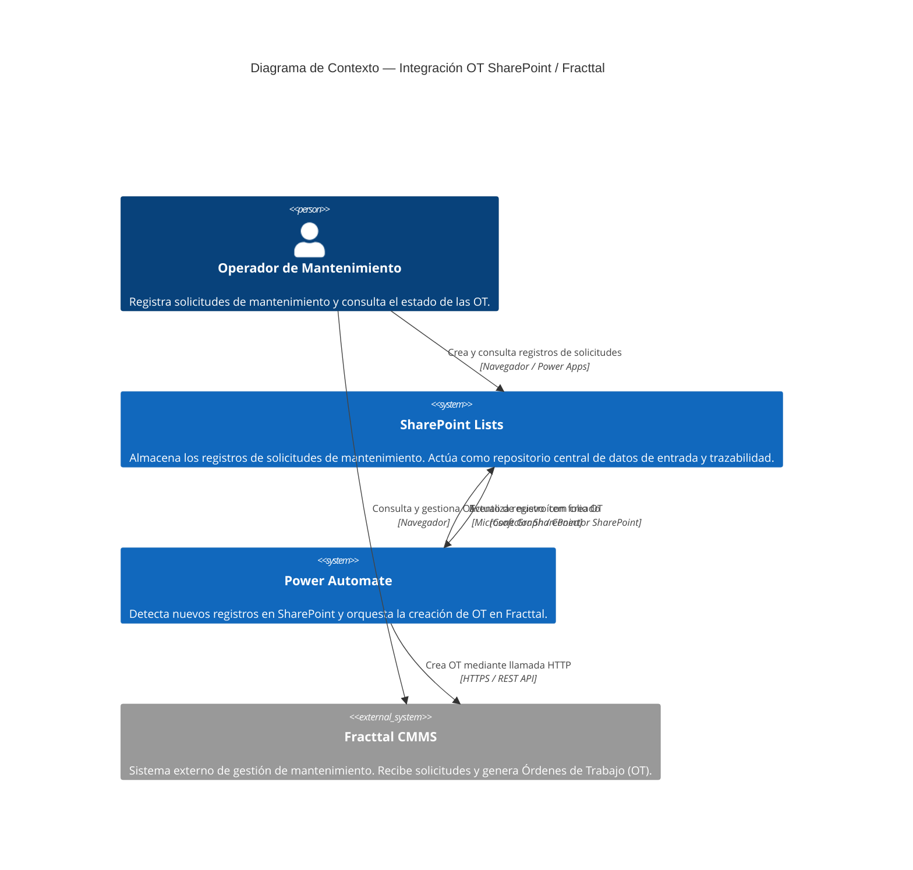
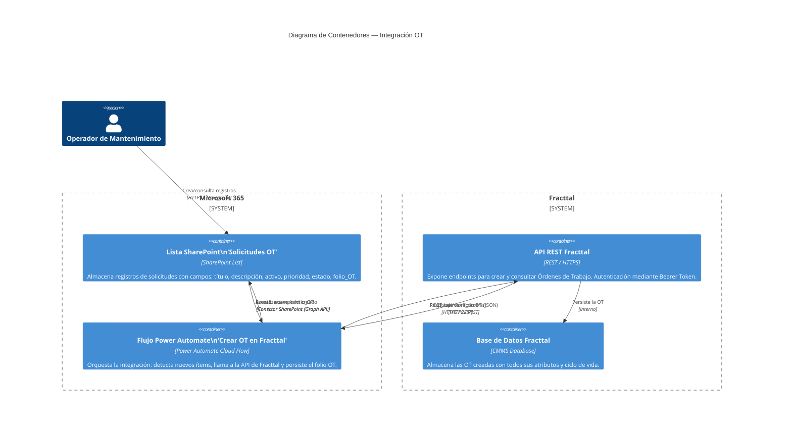
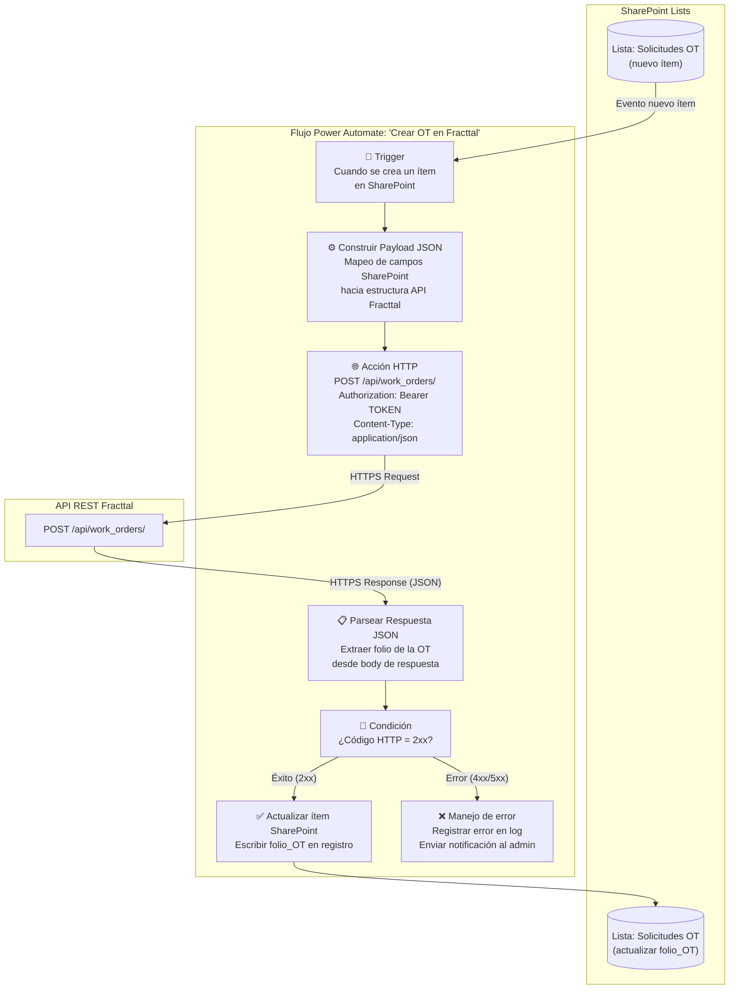
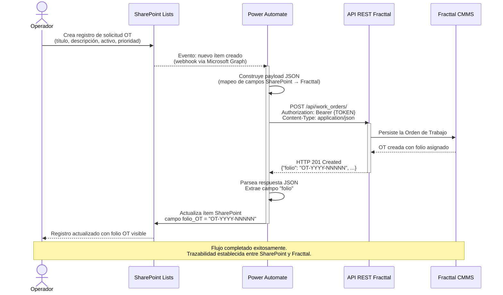
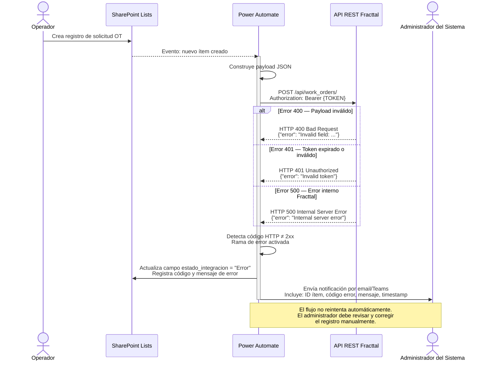
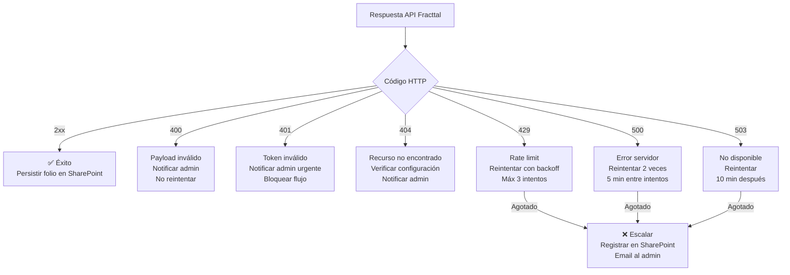
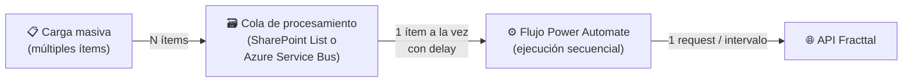
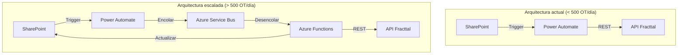

# Documentación Técnica de Arquitectura — Integración SharePoint / Power Automate / Fracttal

> **Versión:** 1.0  
> **Fecha:** 2026-03-09  
> **Autor:** Arquitectura de Software — NICEBIKE Lab  
> **Estado:** Aprobado

---

## Tabla de Contenidos

1. [Contexto del sistema](#1-contexto-del-sistema)
2. [A — Arquitectura C4](#a--arquitectura-c4)
   - [Diagrama de Contexto (C4 Nivel 1)](#a1-diagrama-de-contexto-c4-nivel-1)
   - [Diagrama de Contenedores (C4 Nivel 2)](#a2-diagrama-de-contenedores-c4-nivel-2)
   - [Diagrama de Componentes (C4 Nivel 3)](#a3-diagrama-de-componentes-c4-nivel-3)
3. [B — Diagramas de Secuencia](#b--diagramas-de-secuencia)
   - [Escenario principal (flujo exitoso)](#b1-escenario-principal-flujo-exitoso)
   - [Escenario de error](#b2-escenario-de-error)
4. [C — Architecture Decision Records (ADR)](#c--architecture-decision-records-adr)
   - [ADR-001 — SharePoint Lists como repositorio de solicitudes](#adr-001--sharepoint-lists-como-repositorio-de-solicitudes)
   - [ADR-002 — Power Automate como motor de integración](#adr-002--power-automate-como-motor-de-integración)
   - [ADR-003 — Creación de OT mediante API REST de Fracttal](#adr-003--creación-de-ot-mediante-api-rest-de-fracttal)
5. [D — Especificación de Integración API](#d--especificación-de-integración-api)
6. [E — Manejo de Errores](#e--manejo-de-errores)
7. [F — Observabilidad y Monitoreo](#f--observabilidad-y-monitoreo)
8. [G — Consideraciones de Escalabilidad](#g--consideraciones-de-escalabilidad)

---

## 1. Contexto del sistema

La solución implementa un flujo automatizado de creación de **Órdenes de Trabajo (OT)** en el sistema CMMS Fracttal, impulsado por registros creados en una lista de Microsoft SharePoint. Microsoft Power Automate actúa como motor de orquestación sin código entre ambas plataformas.

### Flujo de alto nivel

```
Usuario → SharePoint List → Power Automate → API Fracttal → OT creada → SharePoint actualizado
```

### Tecnologías involucradas

| Componente | Tecnología | Rol |
|---|---|---|
| Almacenamiento de solicitudes | Microsoft SharePoint Lists | Repositorio de registros de mantenimiento |
| Motor de integración | Microsoft Power Automate | Orquestación del flujo sin código |
| Sistema CMMS | Fracttal | Gestión de mantenimiento y OT |
| Protocolo de integración | REST / HTTPS | Comunicación entre sistemas |
| Autenticación | Bearer Token (API Key) | Autorización hacia la API de Fracttal |

---

## A — Arquitectura C4

### A1. Diagrama de Contexto (C4 Nivel 1)

El diagrama de contexto muestra los actores externos y sistemas con los que interactúa la solución.



**Relaciones clave:**

- El **operador** interactúa con SharePoint para registrar solicitudes de mantenimiento.
- **Power Automate** suscribe eventos de creación en SharePoint y actúa como intermediario.
- **Fracttal CMMS** recibe las solicitudes a través de su API REST y retorna el folio de la OT.
- El folio generado se persiste en SharePoint para mantener la trazabilidad bidireccional.

---

### A2. Diagrama de Contenedores (C4 Nivel 2)

El diagrama de contenedores desglosa la arquitectura interna de la solución identificando cada unidad desplegable.



**Descripción de contenedores:**

| Contenedor | Tecnología | Responsabilidad |
|---|---|---|
| Lista SharePoint 'Solicitudes OT' | SharePoint List | Almacén estructurado de solicitudes de mantenimiento |
| Flujo Power Automate | Cloud Flow | Orquestación: detección, llamada HTTP, persistencia |
| API REST Fracttal | REST / HTTPS | Interfaz de integración del CMMS |
| Base de Datos Fracttal | CMMS interno | Persistencia de Órdenes de Trabajo |

---

### A3. Diagrama de Componentes (C4 Nivel 3)

El diagrama de componentes desglosa los pasos internos del flujo de Power Automate.



**Descripción de componentes del flujo:**

| Componente | Tipo | Descripción |
|---|---|---|
| **Trigger de creación** | Conector SharePoint | Detecta cuando se crea un ítem nuevo en la lista. Se ejecuta en tiempo real mediante webhooks de Microsoft Graph. |
| **Construir Payload JSON** | Acción Data Operations | Mapea campos de SharePoint a la estructura JSON requerida por la API de Fracttal. |
| **Acción HTTP** | Acción HTTP Premium | Ejecuta la llamada `POST /api/work_orders/` con headers de autenticación y el payload construido. |
| **Parsear Respuesta JSON** | Acción Parse JSON | Deserializa el body de respuesta de la API usando un schema JSON. |
| **Condición de éxito/error** | Control — Condition | Evalúa el código de estado HTTP para bifurcar el flujo. |
| **Actualizar SharePoint** | Conector SharePoint | Escribe el folio de la OT en el campo `folio_OT` del registro original. |
| **Manejo de error** | Acción Compose + Email | Registra el error y notifica al administrador del sistema. |

---

## B — Diagramas de Secuencia

### B1. Escenario principal (flujo exitoso)



---

### B2. Escenario de error



---

## C — Architecture Decision Records (ADR)

### ADR-001 — SharePoint Lists como repositorio de solicitudes

| Campo | Detalle |
|---|---|
| **ID** | ADR-001 |
| **Fecha** | 2026-03-09 |
| **Estado** | Aceptado |

#### Contexto

El equipo de mantenimiento necesita un canal estructurado para registrar solicitudes de órdenes de trabajo. Debe ser accesible desde dispositivos móviles y escritorio, integrarse nativamente con el ecosistema Microsoft 365 ya existente y permitir captura de datos con validaciones sin desarrollo de código personalizado.

#### Decisión

Se utiliza **Microsoft SharePoint Lists** como repositorio de solicitudes de OT. Los campos de la lista capturan la información necesaria para crear la OT en Fracttal (título, descripción, activo, prioridad, solicitante). Un campo adicional `folio_OT` almacena el identificador retornado por Fracttal para garantizar la trazabilidad.

#### Consecuencias

**Positivas:**
- Integración nativa con Power Automate sin connectors de terceros.
- Interfaz de usuario configurable con Power Apps o vistas de SharePoint.
- Historial de versiones y auditoría nativa de SharePoint.
- Sin costo adicional (incluido en licencias Microsoft 365).
- Soporte para permisos granulares por columna y vista.

**Negativas:**
- Límite de 30 millones de ítems por lista (umbral de vista: 5.000 ítems sin indexación).
- No es una base de datos relacional; relaciones complejas requieren múltiples listas.
- Latencia en el trigger de Power Automate puede variar (típicamente 1-5 minutos).

#### Alternativas consideradas

| Alternativa | Razón de descarte |
|---|---|
| Microsoft Dataverse | Mayor complejidad de configuración; requiere licencias Power Apps premium. |
| Azure SQL Database | Infraestructura adicional y mayor costo operativo. |
| Formulario web personalizado | Requiere desarrollo, despliegue y mantenimiento de código. |
| Microsoft Forms | No soporta actualizaciones de registros existentes (solo envío). |

---

### ADR-002 — Power Automate como motor de integración

| Campo | Detalle |
|---|---|
| **ID** | ADR-002 |
| **Fecha** | 2026-03-09 |
| **Estado** | Aceptado |

#### Contexto

La solución requiere un mecanismo de integración que detecte eventos en SharePoint, transforme datos y llame a una API REST externa. El equipo no cuenta con recursos de desarrollo de software dedicados, por lo que se prioriza una solución de bajo código (low-code) operable por perfiles de TI funcional.

#### Decisión

Se utiliza **Microsoft Power Automate** (Cloud Flows) como motor de orquestación. El flujo se activa con el conector nativo de SharePoint y ejecuta una acción HTTP Premium para llamar a la API de Fracttal. Esta decisión elimina la necesidad de infraestructura de integración propia (servidores, middleware, pipelines CI/CD).

#### Consecuencias

**Positivas:**
- Sin código: configurable visualmente, mantenible por equipos funcionales.
- Conectores nativos para SharePoint, Microsoft Teams, Outlook.
- Registro de ejecuciones y trazabilidad de errores en el historial del flujo.
- Escalabilidad gestionada por Microsoft (sin configuración de infraestructura).
- Time-to-market reducido frente a soluciones de integración tradicionales.

**Negativas:**
- La acción HTTP es una acción **Premium**, requiere licencia Power Automate con plan adecuado.
- Límites de ejecuciones según plan de licenciamiento (ver [Sección G](#g--consideraciones-de-escalabilidad)).
- Menor flexibilidad para lógica de transformación compleja comparado con código.
- Debugging limitado en comparación con herramientas de desarrollo profesionales.

#### Alternativas consideradas

| Alternativa | Razón de descarte |
|---|---|
| Azure Logic Apps | Mayor costo y complejidad operativa; adecuado para escenarios enterprise de mayor volumen. |
| Azure Functions | Requiere desarrollo de código, despliegue y mantenimiento de infraestructura. |
| MuleSoft / Dell Boomi | Costo de licenciamiento muy elevado; sobrecomplejo para el volumen de transacciones esperado. |
| Zapier / Make | No integración nativa con SharePoint a nivel enterprise; limitaciones en autenticación corporativa. |

---

### ADR-003 — Creación de OT mediante API REST de Fracttal

| Campo | Detalle |
|---|---|
| **ID** | ADR-003 |
| **Fecha** | 2026-03-09 |
| **Estado** | Aceptado |

#### Contexto

Fracttal CMMS expone una API REST para integraciones con sistemas externos. La solución debe crear Órdenes de Trabajo en Fracttal de forma programática, evitando la entrada manual duplicada de datos. Se requiere que la integración sea confiable, autenticada y que retorne el identificador (folio) de la OT creada.

#### Decisión

Se utiliza el **endpoint `POST /api/work_orders/`** de la API REST de Fracttal para crear OT de forma programática. La autenticación se realiza mediante **Bearer Token** (API Key) almacenada como variable de entorno segura en Power Automate. El folio retornado en la respuesta se persiste en SharePoint.

#### Consecuencias

**Positivas:**
- Eliminación de entrada manual duplicada (SharePoint + Fracttal).
- Trazabilidad completa: cada registro SharePoint queda vinculado a su OT en Fracttal.
- Estándar REST ampliamente documentado y compatible con Power Automate HTTP action.
- El token API permite gestión de acceso sin credenciales de usuario.

**Negativas:**
- Dependencia de disponibilidad de la API de Fracttal (SLA externo).
- Cambios en la estructura de la API (breaking changes) requieren actualización del flujo.
- El token API debe rotarse periódicamente y actualizarse en el flujo.
- No se implementa reintentos automáticos en esta versión (mejora futura).

#### Alternativas consideradas

| Alternativa | Razón de descarte |
|---|---|
| Entrada manual en Fracttal | Genera duplicación de esfuerzo y riesgo de inconsistencia de datos. |
| Importación masiva CSV | No soporta tiempo real; requiere proceso batch manual. |
| Integración vía base de datos directa | No recomendado por Fracttal; acoplamiento fuerte y riesgo de integridad de datos. |

---

## D — Especificación de Integración API

### Endpoint de creación de Orden de Trabajo

```
POST /api/work_orders/
```

**Base URL:** `https://{tenant}.fracttal.com` *(reemplazar con la URL del tenant)*

---

#### Headers requeridos

```http
Authorization: Bearer {API_TOKEN}
Content-Type: application/json
Accept: application/json
```

| Header | Tipo | Requerido | Descripción |
|---|---|---|---|
| `Authorization` | string | ✅ Sí | Token de autenticación en formato Bearer. Obtener desde el panel de configuración de Fracttal. |
| `Content-Type` | string | ✅ Sí | Debe ser `application/json`. |
| `Accept` | string | Recomendado | `application/json` para forzar respuesta JSON. |

---

#### Request Body — Ejemplo representativo

```json
{
  "work_order": {
    "title": "Mantenimiento preventivo compresor C-01",
    "description": "Revisión y lubricación de compresor de aire según plan mensual.",
    "priority": "high",
    "type": "preventive",
    "asset_code": "COMP-C01",
    "requested_by": "juan.perez@empresa.com",
    "scheduled_date": "YYYY-MM-DD",
    "estimated_duration": 2.5,
    "location": "Planta Norte — Área Producción",
    "tags": ["preventivo", "compresor", "mensual"]
  }
}
```

**Descripción de campos principales del request:**

| Campo | Tipo | Requerido | Descripción |
|---|---|---|---|
| `title` | string | ✅ Sí | Título descriptivo de la Orden de Trabajo. |
| `description` | string | No | Descripción detallada del trabajo a realizar. |
| `priority` | string | No | Prioridad: `low`, `medium`, `high`, `critical`. |
| `type` | string | No | Tipo de OT: `corrective`, `preventive`, `predictive`. |
| `asset_code` | string | Recomendado | Código del activo registrado en Fracttal al que aplica la OT. |
| `requested_by` | string | No | Email o identificador del solicitante. |
| `scheduled_date` | string (ISO 8601) | No | Fecha programada de ejecución (`YYYY-MM-DD`). |
| `estimated_duration` | number | No | Duración estimada en horas. |
| `location` | string | No | Ubicación física del trabajo. |
| `tags` | array[string] | No | Etiquetas para clasificación y búsqueda. |

> **Nota:** Los nombres exactos de los campos pueden variar según la versión de la API de Fracttal y la configuración del tenant. Verificar con la documentación oficial en el portal de Fracttal.

---

#### Response — Creación exitosa (HTTP 201 Created)

```json
{
  "status": "success",
  "data": {
    "folio": "OT-YYYY-NNNNN",
    "id": 98765,
    "title": "Mantenimiento preventivo compresor C-01",
    "status": "open",
    "priority": "high",
    "type": "preventive",
    "asset_code": "COMP-C01",
    "created_at": "YYYY-MM-DDTHH:MM:SSZ",
    "created_by": "integration-api",
    "url": "https://tenant.fracttal.com/work_orders/OT-YYYY-NNNNN"
  },
  "message": "Work order created successfully."
}
```

**Campos clave de la respuesta:**

| Campo | Tipo | Descripción |
|---|---|---|
| `data.folio` | string | **Identificador principal de la OT** a persistir en SharePoint. |
| `data.id` | integer | ID interno de Fracttal (alternativo al folio). |
| `data.status` | string | Estado inicial de la OT (generalmente `open`). |
| `data.created_at` | string (ISO 8601) | Timestamp de creación en UTC. |
| `data.url` | string | URL directa a la OT en el portal de Fracttal. |

---

#### Endpoint de consulta de Orden de Trabajo

```
GET /api/work_orders/{folio}
```

**Ejemplo:**

```http
GET /api/work_orders/OT-YYYY-NNNNN
Authorization: Bearer {API_TOKEN}
Accept: application/json
```

**Response (HTTP 200 OK):**

```json
{
  "status": "success",
  "data": {
    "folio": "OT-YYYY-NNNNN",
    "id": 98765,
    "title": "Mantenimiento preventivo compresor C-01",
    "status": "in_progress",
    "priority": "high",
    "assigned_to": "tecnico01@empresa.com",
    "created_at": "YYYY-MM-DDTHH:MM:SSZ",
    "updated_at": "YYYY-MM-DDTHH:MM:SSZ"
  }
}
```

---

## E — Manejo de Errores

### Tabla de códigos de error y estrategia de respuesta

| Código HTTP | Nombre | Causa probable | Acción del flujo |
|---|---|---|---|
| `400 Bad Request` | Solicitud inválida | Payload mal formado, campo requerido faltante, tipo de dato incorrecto. | Registrar error detallado. Actualizar campo `estado_integracion = "Error 400"` en SharePoint. Notificar al admin con el mensaje de error de la API. No reintentar. |
| `401 Unauthorized` | No autorizado | Token API inválido, expirado o con permisos insuficientes. | Registrar error. Actualizar campo `estado_integracion = "Error 401"` en SharePoint. Notificar al admin para renovar el token. Detener el flujo. |
| `404 Not Found` | Recurso no encontrado | URL de endpoint incorrecta, `asset_code` no existe en Fracttal. | Registrar error con el payload enviado. Actualizar estado en SharePoint. Notificar al admin para verificar configuración. |
| `429 Too Many Requests` | Rate limit excedido | Se superó el límite de llamadas por segundo/minuto de la API. | Aplicar reintentos con backoff exponencial (intentos: 3, intervalos: 30s, 60s, 120s). Si persiste, registrar error y notificar. |
| `500 Internal Server Error` | Error interno Fracttal | Falla del servidor de Fracttal. | Registrar timestamp y payload. Reintentar después de 5 minutos (máximo 2 reintentos). Si persiste, escalar al soporte de Fracttal. |
| `503 Service Unavailable` | Servicio no disponible | Mantenimiento planificado o sobrecarga del servidor Fracttal. | Encolar la solicitud y reintentar en 10-15 minutos. Actualizar estado en SharePoint como "Pendiente — Reintento". |

---

### Configuración de reintentos en Power Automate

```
Acción HTTP → Configuración → Política de reintentos:
  Tipo: Exponential interval
  Recuento: 3
  Intervalo: PT30S (30 segundos)
  Factor: 2
  Máximo: PT2M (2 minutos)
```

### Diagrama de decisión de errores



---

## F — Observabilidad y Monitoreo

### F1. Logs del flujo en Power Automate

Power Automate mantiene un **historial de ejecuciones** automático que incluye:

| Información | Localización | Retención |
|---|---|---|
| Estado de cada ejecución (éxito/error) | Power Automate → Mi flujo → Historial de ejecuciones | 28 días (plan estándar) |
| Inputs y outputs de cada acción | Detalle de ejecución → Acción específica | 28 días |
| Errores con stack trace | Detalle de ejecución → Acción fallida | 28 días |
| Duración de cada acción | Detalle de ejecución | 28 días |

**Recomendación:** Para retención extendida, enviar logs a **Azure Monitor / Log Analytics** usando la acción HTTP o el conector de Azure en el flujo.

---

### F2. Trazabilidad en SharePoint

La lista SharePoint debe contener los siguientes campos de trazabilidad:

| Campo SharePoint | Tipo | Descripción |
|---|---|---|
| `folio_OT` | Texto de línea única | Folio de la OT creada en Fracttal (ej: `OT-YYYY-NNNNN`). |
| `estado_integracion` | Elección | Estado: `Pendiente`, `Procesado`, `Error`, `Reintentando`. |
| `fecha_integracion` | Fecha y hora | Timestamp de cuando se procesó la solicitud. |
| `mensaje_error` | Texto multilínea | Descripción del error si `estado_integracion = Error`. |
| `url_ot_fracttal` | Hipervínculo | URL directa a la OT en el portal de Fracttal. |
| `intentos_reintento` | Número | Contador de reintentos ejecutados. |

---

### F3. Flujo de trazabilidad extremo a extremo

```
Registro SharePoint (ID: 42)
    ↕ campo folio_OT
Orden de Trabajo Fracttal (folio: OT-YYYY-NNNNN)
    ↕ historial de ejecuciones
Power Automate (Run ID: 08586...)
```

Con este esquema, dado cualquier punto de entrada (ítem SharePoint, folio Fracttal o ejecución Power Automate) es posible rastrear los otros dos componentes.

---

### F4. Alertas recomendadas

| Evento | Canal de notificación | Responsable |
|---|---|---|
| Error 401 (token inválido) | Email urgente al administrador de sistemas | Admin TI |
| Error 500 recurrente (>3 en 1h) | Email + Teams al equipo de mantenimiento | Admin CMMS |
| Flujo deshabilitado inesperadamente | Teams al propietario del flujo | Admin TI |
| Volumen inusual de solicitudes | Email al jefe de mantenimiento | Jefe Mantenimiento |

---

## G — Consideraciones de Escalabilidad

### G1. Límites de la API de Fracttal

| Parámetro | Valor típico | Fuente |
|---|---|---|
| Rate limit por API Key | Variable según plan de suscripción | Documentación Fracttal |
| Tamaño máximo de payload | ~5 MB por request | Estándar REST |
| Timeout de respuesta | 30 segundos recomendado | Configurar en acción HTTP de PA |

> **Acción recomendada:** Contactar a Fracttal para confirmar los límites de rate limiting de su plan contratado antes de implementar procesamientos masivos.

---

### G2. Límites de Power Automate

| Plan | Ejecuciones de flujo / 24h | Acciones / mes | Notas |
|---|---|---|---|
| Power Automate per user | 40.000 runs / usuario | 500.000 acciones | Incluye acción HTTP Premium |
| Power Automate per flow | 15 ejecuciones / minuto | 250.000 acciones / mes | Por flujo individual |
| Microsoft 365 (básico) | 2.000 runs / usuario | 6.000 acciones | No incluye HTTP Premium |

> **Nota:** Los límites exactos pueden variar. Verificar en la [documentación oficial de Power Automate](https://learn.microsoft.com/power-automate/limits-and-config).

---

### G3. Consideraciones para procesamiento masivo

En escenarios donde se creen múltiples solicitudes simultáneamente (ej: carga masiva de mantenimientos), se deben considerar las siguientes estrategias:

#### Estrategia de throttling



#### Recomendaciones concretas

| Escenario | Estrategia |
|---|---|
| **< 50 solicitudes/día** | Flujo estándar sin modificaciones. |
| **50-500 solicitudes/día** | Implementar delay configurable entre llamadas (ej: 2 segundos entre requests). |
| **> 500 solicitudes/día** | Evaluar migración a Azure Logic Apps con control de concurrencia avanzado o Azure Functions con colas de mensajería. |
| **Carga masiva puntual** | Procesar en lotes fuera de horario pico. Usar el parámetro de concurrencia del flujo (máx 1 ejecución paralela). |

---

### G4. Control de concurrencia en Power Automate

Power Automate permite controlar el número de ejecuciones simultáneas del flujo:

```
Flujo → Configuración → Concurrencia
    Activar el control de simultaneidad: ✅ ON
    Grado de paralelismo: 1 (secuencial) — 50 (máximo paralelo)
```

**Recomendación para esta solución:** Configurar con grado de paralelismo **1** inicialmente para evitar superar el rate limit de la API de Fracttal. Ajustar progresivamente según los límites confirmados por Fracttal.

---

### G5. Patrón de escalabilidad recomendado



---

*Documento generado por el equipo de arquitectura de software de NICEBIKE Lab.*  
*Para actualizaciones o consultas, abrir un issue en este repositorio.*
